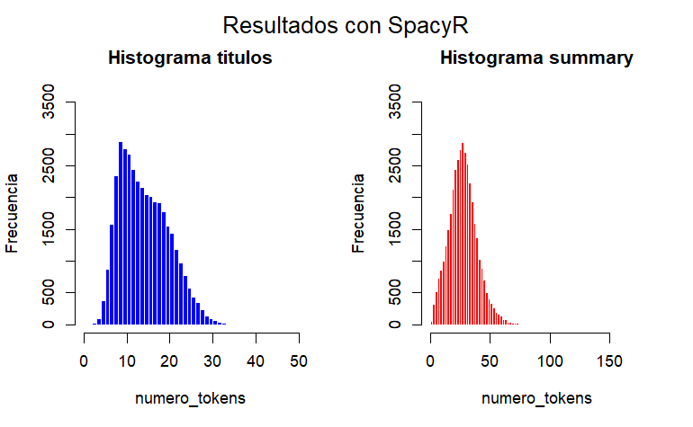
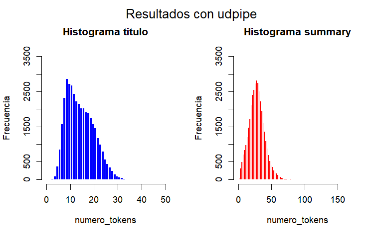

```{r setup, include=FALSE}
knitr::opts_chunk$set(echo = TRUE)
knitr::opts_chunk$set(comment = "")
```
### Grupo 1:

- Oliver Arnaldo Anderson Llorens - oliver.anderson@alumnos.upm.es
- Jose Ma - jose.ma@alumnos.upm.es
- Joaquín Daniel Negrete Saab - joaquin.negrete@alumnos.upm.es
- Anton Pogromskyy - anton.pogromskyy@alumnos.upm.es 
- María del Mar Sierra Gil - mdm.sierra.gil@alumnos.upm.es
- David Gómez Martín - david.gomezm@alumnos.upm.es

### Lista de tareas de cada uno de los integrantes y el porcentaje de contribución:
  - Código Parte 1: María del Mar (100%)
  - Código Parte 2: Jose Ma (50%) y Joaquín Negrete (50%)
  - Código Parte 3: Anton Pogromskyy (70%) y Oliver Arnaldo (30%)
  
  - Pruebas Parte 2: Jose Ma (50%) y Joaquín Negrete (50%)
  - Pruebas Parte 3: Anton Pogromskyy (100%)
  
  - Memoria Parte 1: María del Mar (80%), Jose Ma (15%) y Anton Pogromskyy (5%) 
  - Memoria Parte 2: Jose Ma (50%) y Joaquín Negrete (50%)
  - Memoria Parte 3: Anton Pogromskyy (70%) y Oliver Arnaldo (30%)
  
## Requisitos
- Instalar la librería `testthat`: install.packages("testthat")
- Instalar `udpipe`: install.packages("testthat")
- Instalar `spacyr` con el modelo `es_core_news_sm`

# Parte 1
## Objetivo

1. Leer un archivo JSON lineal con datos textuales en español.
2. Crear un corpus utilizando la librería `quanteda`.
3. Enriquecer el corpus con variables documentales (docvars).
4. Guardar el corpus en un archivo `.rds`.

## Diseño y ejecución:
En este primer programa se pide leer el fichero “spanish_train.json”  y crear un corpus quanteda.

El primer paso fue descargar los datos de la página web de HuggingFace, para posteriormente descomprimir la carpeta obtenida y así poder usar el fichero “spanish_train.json”.

En el código se importarán las librerías jsonlite y quanteda para la realización de esta primera parte.
La función stream_in() del paquete jsonlile nos permite leer y cargar los datos del fichero previamente descargado en la variable data.

Creamos un corpus y asignamos docvars y el contenido del docvar usando el contenido de data (lectura del fichero jsonl)

Por último lo guardamos en un fichero para su posterior uso: fichero spanish_train.qcorpus.rds


```{r include=FALSE}
# Comprobar que está en el directorio padre del trabajo:
getwd()

# Ejecución del fichero
setwd("fuentes")
getwd()
source("train_qcorpus.R")
setwd("../")
```

Comprobamos que el corpus está correctamente creado:

```{r include=FALSE}
corps = readRDS("datos/spanish_train.qcorpus.rds")
```


```{r}
head(corps)
```
```{r echo=FALSE, results = "asis"}
docvars_names <- colnames(docvars(corps))
cat("Las variables del corpus son:  \n", paste(docvars_names, collapse = ", "), "  \n\n")

# Mostrar 3 ejemplos de cada variable
for (var in docvars_names) {
  cat("**Variable:**", var, "  \n")
  examples <- head(docvars(corps)[[var]], 3) # Obtener los primeros 3 ejemplos
  cat("Ejemplos:  \n", paste(examples, collapse = ", "), "  \n\n")
}
```

# Parte 2
## Introducción
Este documento resume el proceso de análisis de un corpus en español mediante el uso de herramientas como `spacy`, `quanteda` y `udpipe`. El objetivo principal fue analizar las estructuras lingüísticas presentes en los títulos y resúmenes del corpus, generando información estadística sobre el número de tokens y su distribución.

## Importación de Librerías y Datos
Primero, cargamos las librerías necesarias (`spacyr`, `quanteda` y `udpipe`) y los datos del corpus, que incluyen los campos de título y resumen. También cargamos un modelo lingüístico para el idioma español (`spanish-ancora`) compatible con `udpipe`.

## Procesamiento con SpaCy
Utilizamos `spacy` para analizar los campos de título y resumen:

1. Parseamos los textos para extraer información lingüística, incluyendo el lema y la categoría gramatical de cada palabra.
2. Filtramos los resultados para eliminar signos de puntuación y enfocarnos en los lemas relevantes.

El resultado fue un subconjunto limpio de datos con los campos `doc_id` (identificador del documento) y `lemma` (forma lematizada de las palabras).

## Creación de Listas de Tokens
Desarrollamos una función personalizada que agrupa los tokens por documento. Esto nos permitió contar el número total de palabras por documento tanto para los títulos como para los resúmenes.
Al principio hicimos una primera función y parecía que no funcionaba correctamente, puesto que no cogía bien las palabras del último documento y tampoco teníamos en cuenta si le pasamos un dataframe sin valores. Aquí le muestro la primera función:

```{r}
lista_agrupada <- function(dataframe_text_lemma) {
  titulos_unicos <- unique(dataframe_text_lemma$doc_id)
  lista_titulos <- list()
  pos_titulo_unico <- 1
  palabras <- 0
  for (i in 1:nrow(dataframe_text_lemma)) {
    if (dataframe_text_lemma[i, 1] == titulos_unicos[pos_titulo_unico]) {
      palabras <- palabras + 1
    } else if (dataframe_text_lemma[i, 1] != titulos_unicos[pos_titulo_unico]) {
      lista_titulos[titulos_unicos[pos_titulo_unico]] <- palabras
      pos_titulo_unico <- pos_titulo_unico + 1
      palabras <- 1
    }
  }
  return(lista_titulos)
}
```

Luego simplemente le añadimos la última fila y ya podrá tener en cuenta el último documento.


Estas listas se usaron posteriormente para generar estadísticas descriptivas.

## Visualización de Resultados
Creamos histogramas para visualizar la distribución del número de tokens en los títulos y los resúmenes:

- Los histogramas de los títulos mostraron la mayoría de los documentos con menos de 50 tokens.
- Los histogramas de los resúmenes mostraron una mayor diversidad, con la mayoría de los documentos teniendo menos de 180 tokens.


## Procesamiento con UDPipe
Para complementar el análisis, utilizamos `udpipe` para realizar un análisis gramatical detallado. Este proceso incluyó:

1. Anotar los textos del corpus con el modelo `spanish-ancora`.
2. Guardar los resultados en ficheros para optimizar el tiempo de procesamiento.
3. Limpiar los datos eliminando puntuación y manteniendo solo los lemas relevantes.


## Comparación de Resultados
Se utilizó la misma función para agrupar y contar los tokens en los datos procesados con `udpipe`. Finalmente, generamos histogramas para comparar la distribución de tokens en los títulos y resúmenes utilizando ambas herramientas.




Como podemos ver, ambos histogramas son casi idénticos, se pueden ver pequeñas diferencias como los valores máximos de cada uno de los tipos: el summary con spacy tiene 172 mientras que el de udpipe tiene 171; el titulo con spacy tiene 37 mientras que el de udpipe tiene 39. Estas diferencias son muy pequeñas y casi no se nota en las gráficas por lo que confirmamos que los resultados obtenidos con `udpipe` son consistentes con los obtenidos previamente con `spacy`.

Se puede ver que el número de palabras que más abundan en títulos está entre 5 y 20, mientras que en el summary están entre 10 y 40, pudiendo ver además que hay una asimetría a la derecha puesto que la mayoría de los datos se encuentran a la izquierda. 

## Prueba
Para llevar a cabo el testing para probar la función y la limpieza de los datos. Podemos ejecutar el siguiente código para comprobar si los tests se ejecutan. 

```{r warning=FALSE}
# Comprobar que está en el directorio padre del trabajo:
getwd()

# Ejecución del fichero
setwd("pruebas")
getwd()
source("test_2.R")
setwd("../")
```
Esto es el resultado comentado:

Test 1: Importación del corpus
Test passed

Test2: Prueba de la función lista_agrupada. La lista se compone de los dos docs y el resultado debe ser 2 y 3
$doc1
[1] 2

$doc2
[1] 3

[1] 2
[1] 3

Test passed

Test3: Prueba de la función lista_agrupada. el dataframe tiene sólo un elemento y se comprueba si da el mismo elemento. El nulo es porque se accede al segundo elemento de la lista el cual no existe
$doc1
[1] 3

[1] 3

NULL
Test passed

Test4: Prueba de la función lista_agrupada con un elemento nulo.

list()
Test passed

Test5: Probamos si se guardan bien los resultados en un fichero
Test passed


Test5: Probamos cómo elimina signos de puntuación del dataframe
sample_data <- data.frame(
        doc_id = c("doc1", "doc1", "doc2"),
        lemma = c("palabra1", "palabra2", NA),
        pos = c("NOUN", "PUNCT", "PUNCT")
    )
Además probamos el acceso al lemma limpio que debe dar "palabra1":

[1] 1
[1] "palabra1"
Test passed

Test6: Probamos el funcionamiento del histograma y el resultado es el esperado de los breaks y count.
[1] 0 1 2 3 4 5
[1] 1 2 3 0 0
Test passed


## Retos y Soluciones
El principal inconveniente encontrado fue el tiempo de procesamiento de `udpipe`. Anotar los títulos y resúmenes del corpus tomó aproximadamente 30 minutos. Para mitigar este problema, guardamos los resultados procesados en ficheros RDS. Esto nos permitió cargar los datos rápidamente en ejecuciones futuras, reduciendo significativamente el tiempo requerido.

## Conclusiones
Este análisis demostró la utilidad de herramientas lingüísticas avanzadas para procesar y analizar textos en español. Los histogramas generados permitieron visualizar la estructura del corpus y entender mejor la longitud promedio de los títulos y resúmenes.


# Parte 3

## Objetivos de la Tercera Parte

En esta parte del proyecto, se nos pide implementar un programa llamado `train_analysis.R` que realice el análisis del corpus obtenido en la primera parte, almacenado en el archivo `spanish_train.qcorpus.rds`. El programa debe calcular, para cada documento, lo siguiente:

1. **Frecuencia de verbos del título**: Contar cuántos verbos, convertidos a su forma en infinitivo, presentes en el campo `title` del documento también aparecen en el texto completo correspondiente.
2. **Frecuencia de verbos del resumen**: Contar cuántos verbos, convertidos a su forma en infinitivo, presentes en el campo `summary` del documento también aparecen en el texto completo correspondiente.


Estos resultados se presentan de manera visual mediante dos histogramas:
- Un histograma para los verbos del `title`.
- Otro histograma para los verbos del `summary`.

En los histogramas obtenidos, se muestra la distribución de las frecuencias de coincidencia y el número de documentos que corresponden a cada frecuencia. Esto permite visualizar de forma clara cómo se relacionan los verbos presentes en los `title` y `summary` con el contenido completo de los textos.


---

## Importación de Código para Tests

Para mantener el documento más organizado y legible, importamos el código de tests desde otro archivo. Esto nos permite ejecutar y mostrar los resultados de las pruebas específicas de las funciones utilizadas en el programa principal sin añadir bloques de código extensos.

La importación se realiza con la función `source()` de R, que permite cargar y ejecutar el contenido de un archivo externo. En este caso, importamos el archivo `test_train_analysis.R`, donde se encuentran definidas las pruebas.


```{r include=FALSE}
source("pruebas/test_train_analysis.R")
```

---

## Uso de Archivos RDS para Optimizar el Procesamiento

Dado que el parseo de textos con la función `spacy_parse()` puede ser un proceso lento y costoso, decidimos implementar una estructura `if-else` para gestionar el almacenamiento y la carga de los datos procesados. La idea principal es evitar realizar el parseo en cada ejecución, almacenando los resultados en archivos `.RDS`, que son compactos y rápidos de cargar.


### Estructura General

La estructura que utilizamos funciona de la siguiente manera:

- **Si el archivo RDS ya existe**:
  - Cargamos directamente los datos procesados con la función `readRDS()`.
  - Esto reduce significativamente el tiempo de ejecución en futuras sesiones.
  
- **Si el archivo RDS no existe**:
  - Parseamos los datos correspondientes con `spacy_parse()` y los guardamos en un archivo `.RDS` utilizando `saveRDS()`.
  - Esto asegura que el procesamiento solo se realiza la primera vez.


### Función `spacy_parse()`

1. **Tokenización**:
   - Divide el texto en **tokens** (en nuestro caso las palabras de los textos).
   
2. **Etiquetado gramatical (POS tagging)**:
   - Asocia cada token con su categoría gramatical (por ejemplo, `VERB`, `NOUN`, `ADJ`).
   
3. **Lematización**:
   - Convierte las palabras a su forma raíz (por ejemplo, "corriendo" → "correr").


El propósito principal de usar `spacy_parse()` en este proyecto es que nos permita trabajar específicamente con los **verbos** en infinitivo de los textos. Esto incluye:

- Identificar todos los verbos en un texto (`pos == "VERB"`).
- Obtener los verbos en su forma **lema** (`lemma`), para evitar inconsistencias debido a conjugaciones.

## Resultado de `spacy_parse()`

Tras realizar el `spacy_parse()` sobre las palabras de los campos `title`, `summary` y los textos completos, obtenemos una tabla estructurada que contiene información clave sobre los tokens del texto. En nuestro caso, nos quedamos con las columnas `lemma` (forma en infinitivo de los verbos) y `doc_id` (identificador único de cada documento).

El uso del `doc_id` es bastante importante, ya que nos permite asociar cada verbo con su documento correspondiente.

### Ejemplo de los Resultados

Verbos del campo `title`:

```{r echo=FALSE}
head(verbs_title)
```

Verbos del campo `summary`:

```{r echo=FALSE}
head(verbs_summary)
```

Verbos de los textos completos:

```{r echo=FALSE}
head(verbs_text)
```

---

## Función `verbs_create_list`

La función `verbs_create_list` organiza los verbos extraídos del corpus en una estructura más manejable, agrupándolos por documento. Su objetivo principal es asociar cada verbo a su documento correspondiente, utilizando el identificador único de cada documento (`doc_id`).

La función toma los verbos extraídos de un campo del corpus, como `title` o `summary`, y los organiza en una lista, donde cada elemento corresponde a un documento específico. Si un documento no contiene verbos en un campo determinado, se incluye en la lista con un vector vacío, asegurando que todos los documentos estén representados de manera consistente.

El resultado de esta función es una lista con nombres que corresponden a los `doc_id` del corpus y cuyo contenido son los verbos en su forma lematizada. Esta estructura facilita el acceso y análisis de los datos, permitiéndonos comparar los verbos presentes en los títulos o resúmenes con los del texto completo de cada documento.

Resultados tras aplicar la función sobre los dataframes obtenidos anteriormente:

Aplicando para `verbs_titles`:

```{r echo=FALSE}
head(list_verbs_titles)
```

Para `verbs_summary`:

```{r echo=FALSE}
head(list_verbs_summary, 3)
```

Lo mismo con `verbs_text`:

```{r echo=FALSE}
print(list_verbs_text[1:3])
```


## Eliminación de Verbos Duplicados

Como indica el enunciado, necesitamos trabajar con los **verbos únicos** de los campos `title` y `summary`, ya que no queremos contar verbos repetidos dentro de un mismo documento. Para lograr esto, definimos la función `make_unique()`, que elimina duplicados en cada elemento de una lista. Su objetivo es garantizar que cada sublista contenga solo valores **únicos**.

La función recorre cada elemento de la lista (correspondiente a un documento) y, si este no está vacío, utiliza la función `unique()` para filtrar los valores duplicados. De esta forma, el resultado es una lista en la que cada sublista contiene únicamente los verbos únicos asociados a su documento.

### Ejemplo de Uso

Si observamos el contenido original de `list_verbs_summary`, en el documento **text_5** aparece el verbo `tener` dos veces. 

```{r echo=FALSE}
list_verbs_summary[5]
```

Después de aplicar `make_unique()`, el resultado muestra este verbo solo una vez.

```{r echo=FALSE}
make_unique(list_verbs_summary[5])
```

---

## Cálculo de Frecuencias de Verbos

Llegamos al núcleo del proyecto: **contar cuántas veces los verbos presentes en los campos `title` y `summary` aparecen en el texto completo de cada documento**. Para ello, definimos la función `freq_verbs`, que calcula la frecuencia total de los verbos en el texto correspondiente.

### Explicación de la Función `freq_verbs`

La función `freq_verbs` toma tres argumentos:

1. **`text_list`**: Lista de verbos en los textos completos.
2. **`list_comp`**: Lista de verbos a comparar (pueden ser de `title` o `summary`).
3. **`corpus_ids`**: Identificadores únicos de los documentos.

El objetivo de esta función es recorrer los textos y contar cuántas veces los verbos presentes en `list_comp` aparecen en el texto completo correspondiente. Para ello:

- Se inicializa un vector vacío llamado `freq`, cuya longitud corresponde al número de documentos, y se asignan los `corpus_ids` como nombres.
- Para cada documento, se recorren los verbos de `list_comp` y se cuenta cuántas veces aparecen en el texto completo (`text_list`) utilizando `sum()`.
- Finalmente, el vector `freq` almacena la frecuencia total de los verbos por documento y se devuelve como resultado.


Aplicamos esta función y obtenemos las frecuencias de los verbos de cada `title` 
en su texto y de cada `summary` en su texto.

Veamos las frecuencias de los `titles` 50 - 70:

```{r}
freq_verbs_titles[50:70]
```

Veamos las frecuencias de los `summary` 50 - 70:

```{r}
freq_verbs_summary[50:70]
```


## Testeos de la Función `freq_verbs`

Para confirmar que los resultados de la función `freq_verbs` son correctos, definimos una nueva función llamada `test_freq_verbs`. Esta función evalúa un subconjunto de documentos y verifica:

- La frecuencia de verbos encontrados en los títulos (`title`) y resúmenes (`summary`) comparados con el texto completo.
- Los verbos coincidentes entre los diferentes campos y las frecuencias correspondientes.

El objetivo de esta prueba es asegurar que los verbos se están contando correctamente y que los resultados coinciden con las expectativas.

Hacemos un test de los textos 56 - 58:

```{r, results = "asis"}
test_freq_verbs(list_verbs_text, list_verbs_title_unique, list_verbs_summary_unique, corpus_ids)
```

---

## Visualización de Frecuencias de Verbos

Para analizar la cantidad de documentos que tienen cierta frecuencia de coincidencia entre los verbos de los resúmenes (`summary`) y los textos completos, generamos un **histograma**. Este histograma nos permite observar cómo están distribuidas las frecuencias de coincidencia entre los documentos.

```{r echo=FALSE}
freq_table1 <- table(freq_verbs_summary)

bar_midpoints <- barplot(freq_table1, 
                         main = "Frequency of Matched Verbs Between Texts and Summaries", 
                         xlab = "Frequency", 
                         ylab = "Number of Documents", 
                         col = "lightblue", 
                         border = "black",
                         ylim = c(0, max(freq_table1) + 1500), 
                         yaxt = "n", 
                         xaxt = "n") # Suppress both axes

y_max <- max(freq_table1) + 2000
y_ticks <- seq(0, y_max, by = 2000) # y-axis subdivisions
axis(2, at = y_ticks, labels = y_ticks, las = 1, cex.axis = 0.8)

x_labels <- as.numeric(names(freq_table1))
axis(1, at = bar_midpoints, labels = x_labels, las = 2, cex.axis = 0.5) # Rotate labels vertically

if (length(bar_midpoints) == length(x_labels)) {
  axis(1, at = bar_midpoints[length(bar_midpoints)], 
       labels = x_labels[length(x_labels)], las = 2, cex.axis = 0.5)
}

# Add labels above all bars
text(bar_midpoints, freq_table1, 
     labels = freq_table1, 
     pos = 3, srt = 45, cex = 0.4, col = "black")
```


Histograma para ver las frecuencias de los verbos del campo **títulos**:

```{r echo=FALSE}
freq_table2 <- table(freq_verbs_titles)
  
bar_midpoints <- barplot(freq_table2, 
                           main = "Frequency of Matched Verbs Between Texts and Titles", 
                           xlab = "Frequency", 
                           ylab = "Number of Documents", 
                           col = "lightblue", 
                           border = "black", 
                           ylim = c(0, max(freq_table2) + 1500),
                           yaxt = "n",
                           xaxt = "n")
  
  y_max <- max(freq_table2) + 2000 # Defines the maximum y-axis value
  y_ticks <- seq(0, y_max, by = 1500) # subdivisions
  axis(2, at = y_ticks, labels = y_ticks, las = 1, cex.axis = 0.8)
  
  x_labels <- as.numeric(names(freq_table2))
  axis(1, at = bar_midpoints, labels = x_labels, las = 2, cex.axis = 0.5) # Rotate labels vertically
  
  if (length(bar_midpoints) == length(x_labels)) {
    axis(1, at = bar_midpoints[length(bar_midpoints)], 
         labels = x_labels[length(x_labels)], las = 2, cex.axis = 0.5)
  }

  # Add labels above all bars
  text(bar_midpoints, freq_table2, 
       labels = freq_table2, 
       pos = 3, srt = 45, cex = 0.4, col = "black")
```

Como se puede observar hay gran cantidad de documentos que tienen frecuencia 0. Al principio esto nos pareció muy raro, pero tras realizar numerosas pruebas y verificar nuestros cálculos, hemos llegado a la conclusión de que estos son correctos. 
Nuestra hipótesis es que el problema radica en las limitaciones del modelo `es_core_news_sm` utilizado por `spacy_parse()`. Este modelo, aunque eficiente y rápido, no identifica correctamente ciertos verbos. Por ejemplo, no reconoce el verbo "ser", lo cual es especialmente significativo dada su alta frecuencia en el idioma español. Además, tampoco maneja bien los verbos pronominales, lo que afecta aún más la precisión de los resultados.

Creemos que si hubieramos usando un modelo de lenguaje español más grande que `es_core_news_sm` los resultados habrían sido más representativos y precisos. 

---

## Testeo para Frecuencias Específicas

Una vez calculadas las frecuencias de coincidencias de verbos entre los resúmenes (`summary`) y los textos completos, podemos realizar testeos para analizar documentos que tienen una frecuencia específica. Esto nos permite observar en detalle los verbos coincidentes en esos casos particulares y asegurarnos de que el cálculo se realiza correctamente.

### Función `test_specific_frequency_summary`

La función `test_specific_frequency_summary` busca documentos que tienen una frecuencia específica de coincidencias en los resúmenes. Para cada documento encontrado:
1. Muestra los verbos del texto completo y del resumen.
2. Indica los verbos coincidentes y cuántas veces se encontraron en el texto.

Si no se encuentran documentos con esa frecuencia, la función informa que no hay coincidencias.

Hagamos un test, por ejemplo, con frecuencia **46**, solo debe aparecer 1 documento con la suma de frecuencias de cada verbo encontrado equivalente a 46.

```{r echo=FALSE, results = "asis"}
test_specific_frequency_summary(46, freq_verbs_summary, list_verbs_text, list_verbs_summary_unique, corpus_ids)
```

Podemos hacer lo mismo con los **títulos**, por ejemplo, con los que tengan frecuencia **63**. Según el histograma, debe aparecer 1 documento con frecuencia 63.

```{r echo=FALSE, results = "asis"}
test_specific_frequency_titles(63, freq_verbs_titles, list_verbs_text, list_verbs_title_unique, corpus_ids)
```


## Retos y Soluciones

### Problema con el Cálculo de Frecuencias

Uno de los desafíos más importantes que enfrentamos fue calcular correctamente las frecuencias de coincidencia de verbos entre los textos y los campos `title` y `summary.` Inicialmente, los histogramas mostraban frecuencias máximas de solo 10, lo cual resultaba poco realista dado que muchos textos contienen cientos de verbos. Además, las frecuencias estaban incorrectamente distribuidas; por ejemplo, el histograma indicaba que había 4 documentos con una frecuencia de coincidencia de 8, pero al verificar manualmente, no había ninguno.

#### Identificación del Problema

Después de analizar el código y realizar múltiples pruebas, descubrimos que el error se debía a que solo estábamos considerando los verbos únicos en lugar de sumar todas las veces que estos aparecían en los textos completos. Esto generaba resultados inconsistentes y poco representativos.

#### Solución Implementada

La solución fue realizar una pequeña modificación en el cálculo de las frecuencias. En lugar de simplemente contar si un verbo estaba presente, sumamos todas las apariciones de cada verbo en el texto correspondiente. Esta corrección, aunque sencilla, tuvo un impacto significativo, permitiéndonos obtener histogramas precisos que reflejan correctamente la distribución de frecuencias.

#### Validación con Tests

Para asegurarnos de que los cálculos eran correctos, utilizamos los tests desarrollados específicamente para esta tarea. Estos tests nos permitieron verificar las coincidencias verbo por verbo, documentando los resultados y confirmando que las frecuencias calculadas eran exactas. Gracias a estas pruebas, podemos afirmar con confianza que los resultados ahora son consistentes y precisos.

